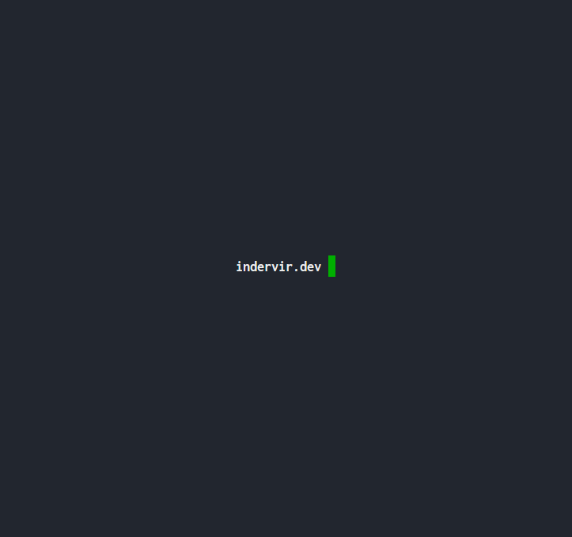

# indervir.dev

My SSH profile page built using Golang and the Charm suite of TUI libraries. You can view it by running the command `ssh indervir.dev` in your terminal of choice.

# How it works

I first had to buy a domain, ended up settling on `indervir.dev`. I routed that domain to my server's IP. After running the application on port 22 I was in business.

# Gif of the ssh page

